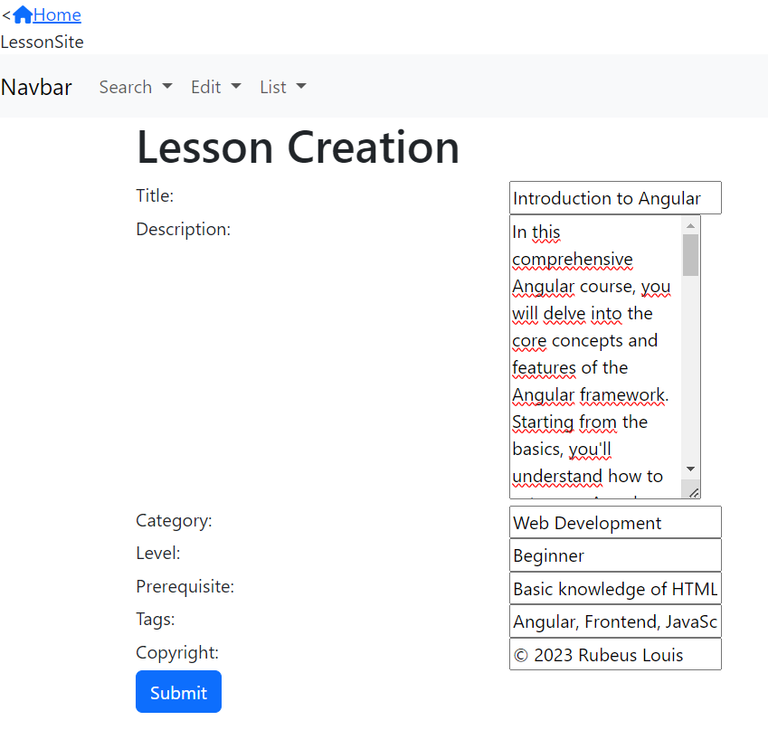

# Project Node

This project was generated with [Angular CLI](https://github.com/angular/angular-cli) version 16.2.9.

## Presentation of the project

This project is designed as a learning platform inspired by anki and based upon what was built during our different TPs. 

Anki uses personalisable flashcards for learning, in our project those cards are implemented as customizable lessons.

Our website is composed of the page and a topside navigation bar allowing access to the different sections. 

The different sections are : Home, Search, Edit And List

Our website is structured around the lessons provided by users.

The features of those lessons are:

Tittle , Description, category , level, prerequisite, tags, copyright.

The Search Tap allows for quick and easy access to lessons, it performs like any search bar. The user inputs search terms and the corresponding lessons will be displayed.

Lessons can be created within the lesson Creation Tab. Its usage is simple: enter the information in the corresponding spaces and submit it.

Finally The List Tab allows quick access to the whole available database of lessons

## Contribution

For our project every member actively contributed to the project however that is not reflected on the commit history as we had trouble adjusting to github.

We worked together on the different features, everyone did about 25%.

## Development server

Run `ng serve` for a dev server. Navigate to `http://localhost:4200/`. The application will automatically reload if you change any of the source files.

## Code scaffolding

Run `ng generate component component-name` to generate a new component. You can also use `ng generate directive|pipe|service|class|guard|interface|enum|module`.

## Build

Run `ng build` to build the project. The build artifacts will be stored in the `dist/` directory.

## Running unit tests

Run `ng test` to execute the unit tests via [Karma](https://karma-runner.github.io).

## Running end-to-end tests

Run `ng e2e` to execute the end-to-end tests via a platform of your choice. To use this command, you need to first add a package that implements end-to-end testing capabilities.

## Screen site

## Further help

To get more help on the Angular CLI use `ng help` or go check out the [Angular CLI Overview and Command Reference](https://angular.io/cli) page.
